<div align="center">

<!-- Minecraft Style Pixel Sloth Animation -->


<!-- Realistic Animated SVG Header Banner -->


<br/><br/>

<!-- Typing Animation -->
<a href="https://github.com/Viv-19">
  
</a>

<br/><br/><br/>

<!-- Profile Badges -->
[](https://github.com/Viv-19?tab=followers)
&nbsp;&nbsp;&nbsp;&nbsp;&nbsp;&nbsp;
[](https://www.linkedin.com/in/vivesh-kumar-singh-a78048302/)
&nbsp;&nbsp;&nbsp;&nbsp;&nbsp;&nbsp;
[](mailto:viveshkrsingh19@gmail.com)

</div>

<br/>

---

## 🦥 About Me

```python
class SlothDeveloper:
    def __init__(self):
        self.name = "Vivesh Kumar Singh"
        self.role = "AI/GenAI Developer & Researcher"
        self.education = "M.Sc AI & ML @ IIIT Lucknow"
        self.location = "Lucknow, India 🇮🇳"
        self.coffee_cups_today = float('inf')

    def current_work(self):
        return [
            "🔬 Research Intern @ TCS-Intel Collaboration",
            "🦥 Building Academic Sloth - AI Research Assistant",
            "🧠 Fine-tuning LLMs for edge deployment",
            "☕ Converting caffeine into code"
        ]

    def fun_fact(self):
        return "Sloths sleep 15-20 hrs/day. I code 15-20 hrs/day. We're basically the same. 🦥"
```

<br clear="both"/>

---

## ⚡ Tech Arsenal

<div align="center">

### 🧠 AI & GenAI


### 🤖 LLM & MLOps


### 🌐 Full Stack


### ☁️ Cloud & DevOps


</div>

---

## 🚀 Featured Projects

<div align="center">

<a href="https://github.com/Viv-19/Academic-Sloth">
  
</a>
<a href="https://github.com/Viv-19/personal-ollama-coder">
  
</a>
<a href="https://github.com/Viv-19/n8n-autonomous-ai-job-hunt-assistant-">
  
</a>
<a href="https://github.com/Viv-19/rag_research_paper_finder_and_chat_bot">
  
</a>

</div>

---

## 🏆 Achievements & Experience

<table align="center">
<tr>
<td align="center" width="200">
  <h3>🔬</h3>
  <b>TCS × Intel</b><br/>
  <sub>Research Intern</sub><br/>
  <sub><i>LLM Numerical Robustness</i></sub>
</td>
<td align="center" width="200">
  <h3>☁️</h3>
  <b>INAI Worlds</b><br/>
  <sub>AI Engineer Intern</sub><br/>
  <sub><i>AWS Cloud Architecture</i></sub>
</td>
<td align="center" width="200">
  <h3>🎯</h3>
  <b>IIT JAM 2024</b><br/>
  <sub>Mathematics</sub><br/>
  <sub><i>AIR 1269 Nationwide</i></sub>
</td>
<td align="center" width="200">
  <h3>💻</h3>
  <b>Competitive Coding</b><br/>
  <sub>CF Pupil • LC 1600+</sub><br/>
  <sub><i>200+ DSA Problems</i></sub>
</td>
</tr>
</table>

---

<div align="center">

### 🦥 _"Why rush when you can build something great... slowly?"_

<br/>

**☕ Fuel Counter**


<sub>* It's not a bug, it's an undocumented feature 🦥</sub>

<br/><br/>


</div>
